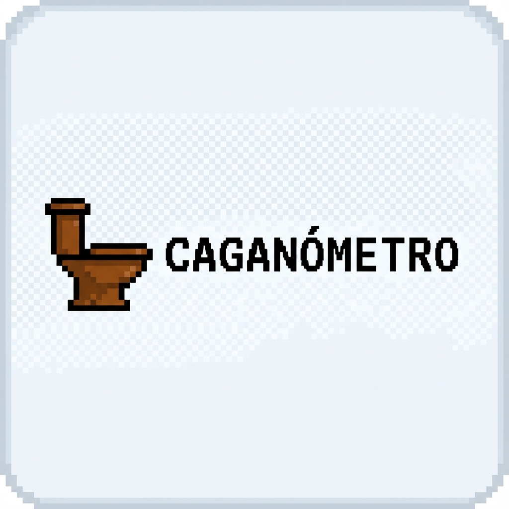
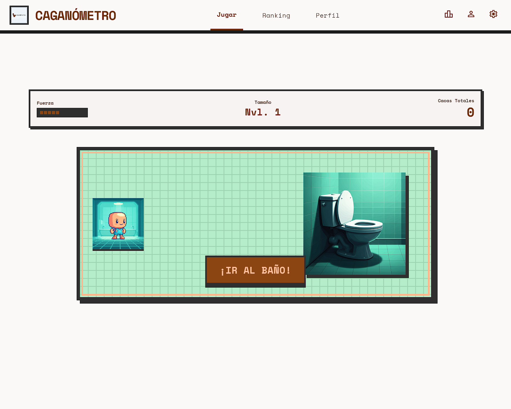
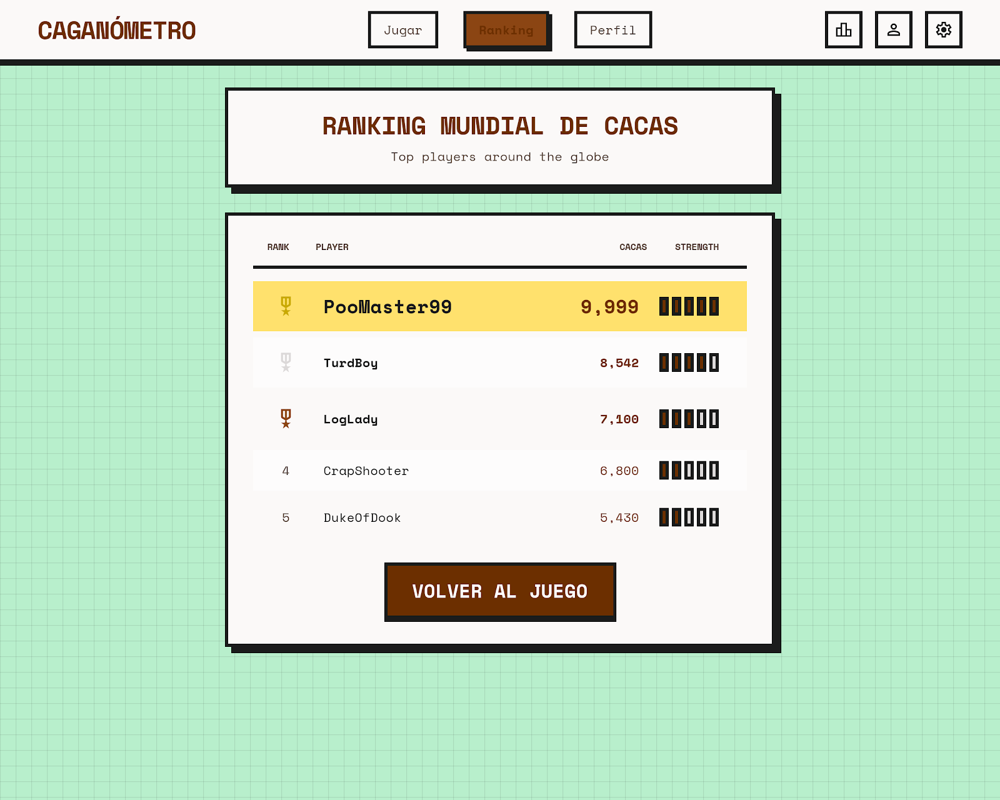
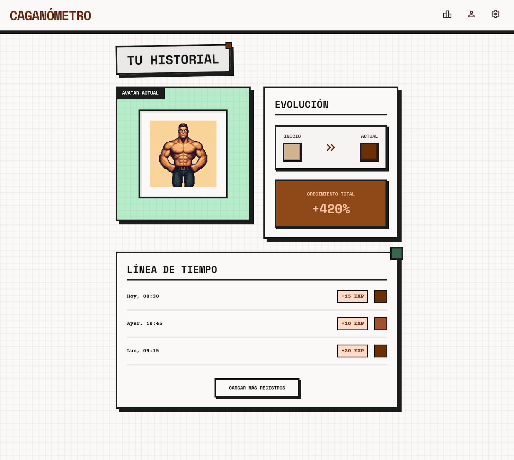
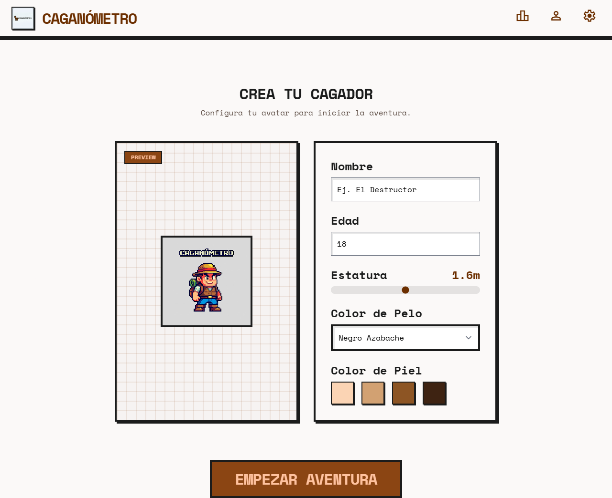

# CAGANOMETRO



**Caganometro** es un RPG competitivo de oficina con alma de arcade pixel art. Aqui no se lucha por salvar reinos ni derrotar dragones: aqui se compite por conquistar el trono del bano corporativo, sobrevivir a la presion del turno laboral y entrar en la leyenda del ranking mundial de cagadores.

## La leyenda del trono porcelanico

Dicen los viejos narradores del open space que, cuando el reloj marca la hora muerta de la productividad y el cafe ya ha hecho su trabajo, despierta una fuerza ancestral entre escritorios, archivadores y fluorescentes cansados.

En ese momento, los trabajadores dejan de ser simples empleados.

Se convierten en aspirantes.

Aspirantes al Trono Blanco.

Cada oficinista carga con su propia historia: un apodo ganado en recursos humanos, talentos dudosos, debilidades vergonzosas y una voluntad de acero forjada entre reuniones innecesarias. Unos corren ligeros hacia el bano como exploradores de elite. Otros avanzan con la dignidad rota, pero con el corazon encendido por la promesa de una nueva marca.

En **Caganometro**, cada viaje al bano es una mision. Cada descarga suma poder. Cada victoria reordena la jerarquia de la oficina. Y mientras unos empleados celebran su ascenso en el ranking, otros juran venganza desde la humillacion del cuarto puesto.

No hay paz entre cubiculos.

Solo competencia.

Solo gloria.

Solo caca.

## Capturas del juego

### Pantalla principal



### Ranking de leyendas



### Perfil del empleado



### Personalizacion de personaje



## De que va

Creas una cuenta, reclutas empleados pixelados para tu plantilla, diseñas su expediente y los mandas a cumplir la mision mas importante de la jornada: ir al bano antes que el resto del mundo. El juego mezcla interfaz React, una escena jugable en Phaser y un backend con ranking persistente para convertir un chiste demencial en una fantasia competitiva de oficina.

## Mecanicas principales

- Creacion y edicion de personajes con nombre, nickname, descripcion, habilidades, fortalezas y debilidades.
- Personalizacion visual de pelo, piel y presencia del avatar.
- Seleccion de plantilla para alternar entre varios empleados jugables.
- Escena 2D pixel art donde el personaje se levanta, camina al bano, cumple su destino y regresa.
- Evolucion del personaje tras cada visita: suben las cacas, la fuerza y el tamano.
- Ranking global con medallas para los lideres del caos sanitario.
- Tarjeta de ranking compartible para presumir la hegemonia fecal.

## Fantasy corporativa del sistema

La oficina funciona como una ciudad-estado decadente.

- El hub es el salon de reclutamiento de la empresa.
- El creador de personajes es el archivo imperial de empleados.
- La escena jugable es el campo de batalla.
- El bano es la mazmorra final.
- El leaderboard es el libro de cronicas donde quedan inscritos los nombres de los heroes y villanos del retrete.

## Stack

- `React 19` + `Vite` para la interfaz.
- `Phaser 3` para la escena jugable 2D pixel art.
- `Node.js` + `Express 5` para autenticacion, acciones de juego y ranking.
- `TypeScript` en cliente y servidor.
- `Prisma` preparado para evolucionar la persistencia.
- Persistencia local JSON en el estado actual para desarrollo rapido.

## Estructura del proyecto

- `apps/client`: interfaz, flujo del jugador y escena Phaser.
- `apps/server`: API, auth, ranking y logica del juego.
- `stitch_cagan_metro_pixel_evolution`: referencias visuales y capturas base del universo del juego.
- `PLAN_CAGANOMETRO.md`: roadmap del proyecto.

## Arranque rapido

```bash
pnpm install
Copy-Item apps/server/.env.example apps/server/.env
pnpm db:generate
pnpm db:migrate
pnpm dev
```

Cliente: `http://localhost:5173`  
API: `http://localhost:3000`

## Bucle de juego

1. Registras tu cuenta o inicias sesion.
2. Creas uno o varios empleados con su propio expediente.
3. Eliges quien entra de turno en la oficina.
4. Pulsas `IR AL BANO`.
5. El personaje ejecuta su recorrido en tiempo real.
6. El backend registra la hazana y actualiza estadisticas y ranking.
7. Compartes el resultado y alimentas nuevas rivalidades.

## Tono del proyecto

Este juego esta hecho como una parodia epica de la vida de oficina: exagerado, sucio, competitivo y orgullosamente ridiculo. La idea no es esconder el chiste, sino abrazarlo con una presentacion que parezca el inicio de una aventura de rol sobre heroes miserables atrapados entre Excel, cafe recalentado y destinos intestinales inevitables.

## Estado actual

El proyecto ya cuenta con flujo jugable base, autenticacion, seleccion de personajes, ranking y escena animada. La siguiente evolucion natural es mejorar sprites, feedback visual, logros y la persistencia final.
